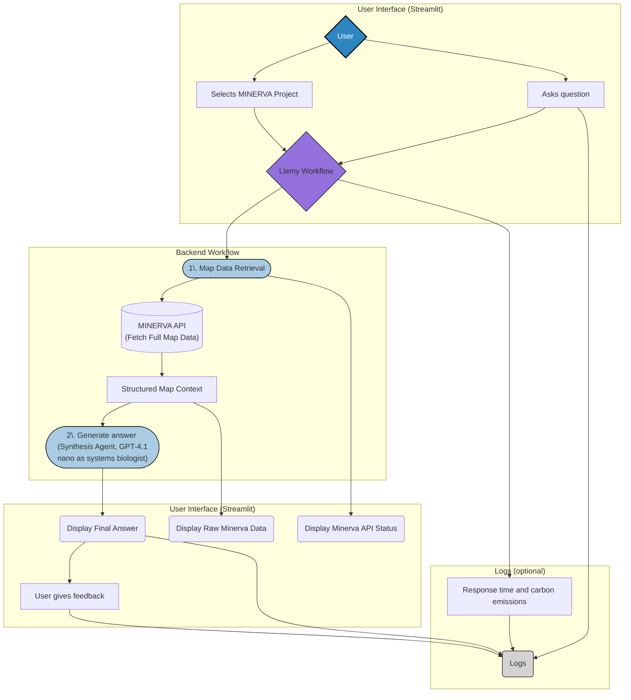

# Llemy

An agent system for answering specialized questions on physiological maps by combining structured knowledge from user-selected MINERVA API maps.

## Overview

Llemy is a prototype application that provides an interface for querying and retrieving information from MINERVA project maps. It uses a two-agent workflow:

1. **Minerva Agent**: Fetches and processes the full map data from a user-selected MINERVA project.
2. **Synthesis Agent**: Generates an answer to the user question based on the map data.


## Workflow



## Features

- Natural language question answering
- Integration with MINERVA API for structured map data
- User interface for selecting a MINERVA project to query.
- Chat-based Streamlit interface with example questions
- Error handling with automatic retries
- Detailed API call status and raw Minerva data displayed for transparency.
- Optional logging of feedback on answers

## Requirements

- Python 3.10 or higher
- API key for OpenAI API (for the synthesis agent)

## Installation

1. Clone the repository or download the files

2. Navigate to the project directory:
   ```bash
   cd Llemy
   ```


3. Install the required dependencies:
   ```bash
   pip install -r requirements.txt
   ```


## Usage

### Running Locally

1. Start the Streamlit application:
   ```bash
   streamlit run app.py
   ```
   
2. The application will open in your web browser (typically at http://localhost:8501)

### Running with Docker

1. Build the Docker image from the `Llemy/` directory:
   ```bash
   docker build -t llemy .
   ```

2. Run the Docker container, mapping the port and passing your API keys as environment variables:
   ```bash
   docker run -p 8501:8501 \
     -v $(pwd)/logs:/app/logs \  #to record logs
     llemy:latest
   ```

3. The application will open in your web browser (typically at http://localhost:8501)


3. **Select a MINERVA project from the sidebar.**
4. Enter your question in the chat input, or select one of the example questions from the sidebar.

5. The system will process your question through the multi-agent workflow using the selected MINERVA project and display a comprehensive answer.

## Example Questions

- What is the scope of this map? Give me a brief summary of the biology represented.
- What is the overall scope of the disease map (molecular, cellular, tissue, or organism-level)?
- What are the inputs, regulators, and phenotypic outputs of this system?
- Which triggers initiate the possible pathological response represented by this map, and which drivers maintain it?
- Which regulatory checkpoints limit over-activation of the pathways leading to pathological phenotypes?
- How does the microenvironment (inflammatory and metabolic) modulate core pathways?
- Are there any inter-organelle interactions (nucleus, mitochondria, membrane, ER) mapped?
- Which stress pathways (DNA damage, ER stress, oxidative stress, unfolded protein response) are represented in the map?
- Which sentinel nodes serve as proxies for system state?
- Does the map capture temporal aspects (e.g. early vs late disease stages)?
- Is the mapped system tissue- or cell-type specific? Or are there multiple tissues or cell-types represented?

## Project Structure

```
Llemy/
├── requirements.txt      # Project dependencies
├── README.md             # This file
├── Dockerfile            # Docker build instructions
├── .dockerignore         # Files to ignore when building Docker image
├── config.py             # Helper functions to prompt for API keys
├── __init__.py           # To make it a python package
├── minerva_client.py     # MINERVA API client
├── minerva_utils.py      # Helper functions to get MINERVA public projects list and structure links to maps in LLM answer
├── workflow.py           # LangChain agent workflow
└── app.py                # Main page of the Streamlit UI application
└── pages                 # multi-page app
   └── Consent.py         # informed consent information
   └── Instructions.py    # instructions to use the app
└── logs                  # to record feedback ; optional. also logs carbon usage and processing time
└── .streamlit            
   └── config.toml        # Streamlit config file

```

## Troubleshooting

- **Module Import Errors**: Verify that all dependencies are installed correctly
- **API Timeouts**: The application includes retry logic for API calls, but persistent timeouts may indicate API service issues
- **Memory Issues**: For complex queries, ensure your system has sufficient memory

## Future Improvements

- Adding more specialized data sources beyond Minerva (OpenTargets, etc.)
- Adding vector storage for caching and more efficient similar question handling
- Adding visualization capabilities for molecular structures and pathways
- Implementing fully asynchronous execution for faster response times
- Import maps as KGs
- Prompt parsing (entity recognition, concept matching for RAG)

## License

This project is intended for research and educational purposes only.

## Authors

- Marie Corradi
- Marek Ostaszewski
- Ivo Djidrovski
- Luiz Carlos Maia Ladeira 
- Bernard Staumont

## Acknowledgements

- This project was a collaboration between ONTOX, ELIXIR-LU and VHP4Safety.
- MINERVA API for providing structured data physiological/disease maps.
